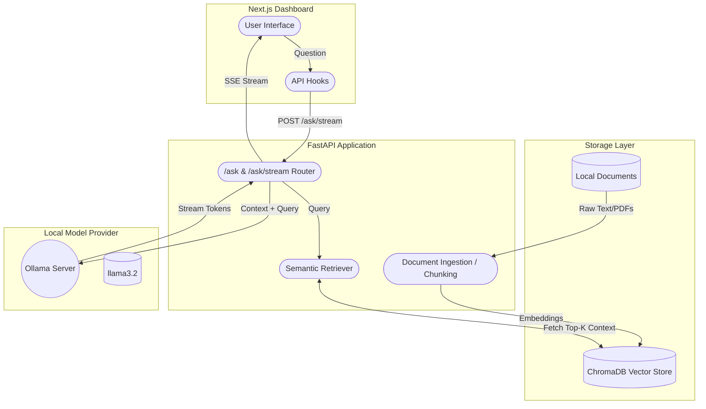

# AI Knowledge Assistant (RAG System)

A production-grade Retrieval-Augmented Generation (RAG) system built to ingest your documents and answer questions contextually using local LLMs.

## Project Overview

The **AI Knowledge Assistant** empowers users to extract insights from personal or organizational documents (`.pdf`, `.txt`) completely offline and privately. By orchestrating robust chunking, semantic vector embeddings, and LLM generative logic powered by Ollama, it maintains a pure self-hosted AI architecture without relying on external APIs.

The system streams responses in real-time, reducing perceived latency, while consistently citing the exact document sources.

## Architecture



## Tech Stack

- **Backend:** Python, FastAPI, Contextual Generators (Async).
- **Vector Database:** ChromaDB (persistent local storage).
- **LLM Engine:** Ollama providing Llama3.2 (`11434`).
- **Embeddings:** HuggingFace `sentence-transformers` (`all-MiniLM-L6-v2`).
- **Frontend:** Next.js, React, Tailwind CSS.
- **Containerization:** Docker & Docker Compose.

## 🚀 Setup & Execution

### Prerequisites
- Docker Engine & Docker Compose installed.
- Local documents to ingest in `./backend/documents/`.

> [!WARNING]
> By default, `docker-compose.yml` executes using CPU fallback since host hardware environments differ. To enable lightning-fast inference, uncomment the `deploy` configuration block within `docker-compose.yml` under the `ollama` service to pass-through your host NVIDIA GPU. *(Requires NVIDIA Container Toolkit)*

### 1. Start the stack

```bash
docker-compose up --build
```
This commands builds the backend and frontend. The `ollama-pull` companion container will wait for the Ollama service to boot and automatically pull the `llama3.2` model if not present.

### 2. Ingest Documents

Place your files (PDFs/TXT) into `./backend/documents/`.
Run the ingestion pipeline natively inside the backend container:

```bash
docker-compose exec backend python ingest.py
```
*(Optionally append `--clear` if you need to wipe out the existing vector store first.)*

### 3. Usage

Access the Web UI at:
**http://localhost:3000**

## API Documentation

### 1. `POST /ask`
Synchronous question-answering. Wait for the full completion.

**Request:**
```json
{
  "question": "What is the core topic of the documents?"
}
```

**Response:**
```json
{
  "answer": "The documents primarily discuss the implementation of distributed systems...",
  "sources": ["overview.pdf", "notes.txt"]
}
```
*Curl Example:*
```bash
curl -X POST "http://localhost:8000/ask" -H "Content-Type: application/json" -d '{"question":"Explain the architecture."}'
```

### 2. `POST /ask/stream`
Token-by-token streaming generator using Server-Sent Events (SSE).

**Request:** Same payload.
**Response Stream (SSE format):**
```text
data: {"token": "The"}
data: {"token": " architecture"}
data: {"token": " is"}
...
data: {"done": true, "sources": ["docs.txt"]}
```

## Testing

A `pytest` suite covers unit logic. Run this inside the backend container or locally:

```bash
cd backend
uv run pytest
```

## Design Decisions

1. **Fully Asynchronous HTTP Networking:** The `OllamaClient` handles streaming through an underlying `httpx.AsyncClient` alongside asynchronous ASGI generator endpoints internally in FastAPI. This removes threadpool-blocking issues observed in traditional synchronous HTTP bridges.
2. **Local Processing for Compliance:** All endpoints utilize a container-local `ollama` configuration routing to avoid API limits and maintain document data compliance.
3. **Lifespan Context Resource Loading:** The system initializes the heavier embedding ML-models and Chroma client configurations strictly during the FastAPI boot lifespan instead of ad-hoc on the first incoming request, radically accelerating user "Time to First Byte" responses.

## Limitations

- **Naive Chunking Algorithm:** Basic character limitations split data. Contextually smart semantic chunking isn't implemented (e.g. MarkdownSplitter or recursive splitting limits).
- **Single Thread LLM Capacity:** Running Ollama strictly on local infrastructure restricts concurrent user processing. An architecture handling scale requires an external VLLM cluster or batched queuing.

## Future Improvements

1. **Semantic Text Chunking:** Improve the context ingestion script to understand Markdown headers and logical PDF paragraphing so semantic boundaries aren't broken.
2. **Metadata Filtering:** Integrate explicit document metadata (Tags, Author, Dates) filtering directly inside ChromaDB retrievals.
3. **Conversational Memory buffer:** Pass historical Redis-cached Chat summaries to context strings for multi-turn conversational agents.
